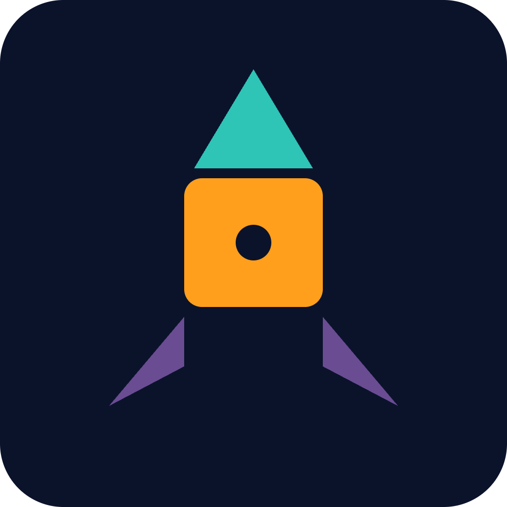

# PartForge


**Collect and trade rocket component NFTs, then assemble them into working ships.**

## Overview

PartForge treats individual rocket components, engines, fuel tanks, and fins, as tradable NFTs with on-chain stats. Players collect, trade, and combine these parts into custom rocket builds, and a simulation engine reads each part's NFT metadata to calculate real flight performance. This turns part trading into strategic, verifiable gameplay rather than pure collecting.

## Problem

Existing NFT games rarely let component-level assets meaningfully affect gameplay mechanics in a transparent, verifiable way. Items are often cosmetic, and there's no clear, auditable link between what a player owns and what happens in-game.

## Solution

PartForge encodes each rocket part's stats on-chain, so simulation outcomes are provably derived from the NFTs a player actually owns. This makes collecting and trading parts strategically valuable, since better parts lead to measurably better rocket performance.

## Features (MVP)

- Mint individual rocket parts (engine, tank, fin) as NFTs with on-chain stats
- Inventory UI to select owned parts and assemble a rocket
- Simulation engine that computes flight results from combined part stats
- Marketplace to buy, sell, and trade individual part NFTs
- Rarity tiers that affect part performance and market value

## Tech Stack

- **Chain:** Solana
- **On-chain:** Anchor, Metaplex Token Metadata
- **Frontend:** React, Phantom Wallet Adapter
- **Backend:** Node.js

## How It Works

```
[Phantom Wallet] -- connect --> [React Frontend]
       |                              |
       |                       Inventory & Assembly UI
       |                              |
       v                              v
[Anchor Programs on Solana] <---> [Node.js Backend]
       |                              |
  Mint / Trade Part NFTs       Simulation Engine
  (Metaplex Token Metadata)   reads on-chain part stats
       |                              |
       +---------> Flight Performance Result <---------+
```

Parts are minted as NFTs with stats stored via Metaplex Token Metadata. Anchor programs handle minting, assembly, and marketplace trades. The backend simulation engine reads the on-chain metadata of assembled parts and computes flight performance, ensuring results are provably tied to owned NFTs.

## Roadmap

- Add crafting/fusion mechanic to combine parts into rarer ones
- Launch seasonal part drops and limited edition engines
- Build a leaderboard tying part quality to competitive rankings

## Pitch

See our full pitch deck at [docs/pitch.pdf](docs/pitch.pdf) and the spoken pitch script at [docs/pitch-script.md](docs/pitch-script.md).

## Team

- Name Placeholder — Role Placeholder
- Name Placeholder — Role Placeholder
- Name Placeholder — Role Placeholder

Built for the Colosseum hackathon.

---

🎬 Pitch video: [docs/pitch-video.mp4](docs/pitch-video.mp4)
